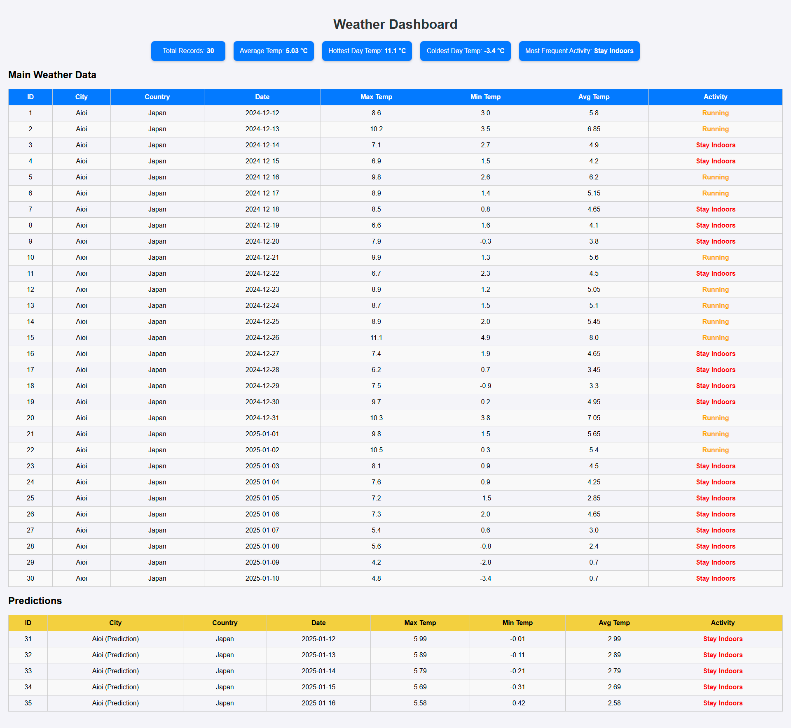

# Weather Service Application

## Overview

This Weather Service Application fetches weather data for a random city, stores it in a database, and provides predictions and activity suggestions. It is deployed using Docker and Kubernetes on Azure and includes a web-based dashboard for visualization.

---

## Features

- Fetches weather data for a random city using a free API.
- Stores 30 days of weather data in an SQLite database.
- Predicts weather for the next 5 days using Linear Regression.
- Suggests activities based on weather using K-means clustering with fallback logic.
- Provides a user-friendly dashboard to view the data and predictions.

---
## Design Decisions

### Why Use a CSV File for City Selection?

While developing this project, I evaluated several free weather APIs. Most of them had strict limitations, such as API rate limits, subscription requirements, or incomplete city datasets. To overcome these challenges, I opted to use a publicly available `worldcities.csv` file, which provides a comprehensive list of cities along with their geographic coordinates. By randomly selecting cities from this dataset, the service ensures a seamless experience without being constrained by API limitations.

### CLI Script (`setupInCli.ps1`)

The Azure CLI script (`setupInCli.ps1`) automates the process of setting up resources on Azure, including:

- Creating a resource group.
- Setting up an Azure Container Registry (ACR).
- Deploying a Kubernetes cluster (AKS).
- Connecting the local Kubernetes CLI (`kubectl`) to the AKS cluster.

This script was designed to simplify resource creation and minimize manual errors. It is included in the repository for reference but has already been executed during the deployment process.


## How to Access the Service

The service is already deployed and running. You can access it using the following steps:

1. Open your browser and navigate to the following URL:
   http://51.4.41.235:5000

2. You will be directed to the dashboard, where you can view:

- 30 days of weather data for the selected city.
- Predictions for the next 5 days in a separate section.
- Display of trends in temperature and suggested activities.

Below is a snapshot of the dashboard:



## Development Setup (Optional for Local Testing)

If you want to run the application locally for development purposes, follow these steps:

### Prerequisites

- [Python 3.9+](https://www.python.org/downloads/)
- [Docker](https://www.docker.com/)

### Steps

1. **Clone the Repository**

```bash
git clone <your-repo-link>
cd <your-repo-folder>

Set Up a Virtual Environment:

python -m venv venv
source venv/bin/activate  # On Windows: venv\Scripts\activate
pip install -r requirements.txt

Run the Application Locally:
python main/app.py
Access the service locally at: http://127.0.0.1:5000

Or you can run weather.py (python main/weather.py) and you can see the result in SQlite by uploading the weather_data.db from the data folder.


📂 microsoft-assignment
├── Azure_Cli/
│   └── setupInCli.ps1      # Azure CLI setup script (already used for setup)
├── data/
│   ├── weather_data.db     # SQLite database
│   └── worldcities.csv     # List of cities
├── main/
│   ├── templates/
│   │   └── dashboard.html  # Dashboard template
│   ├── app.py              # Main Flask application
│   ├── weather.py          # Weather data fetching and processing script
│   └── test_weather_service.py # Test script
├── Utils/
│   ├── database_utils.py   # Database operations
│   ├── city_utils.py       # City selection utilities
│   ├── weather_utils.py    # Weather API utilities
│   └── something_useful.py # Prediction and clustering
├── deployment.yaml         # Kubernetes deployment configuration
├── service.yaml            # Kubernetes service configuration
├── Dockerfile              # Docker image configuration
├── requirements.txt        # Python dependencies
└── README.md               # Instructions


Methodologies Used:
1. Linear Regression
Used for predicting the average, minimum, and maximum temperatures for the next 5 days.

2. K-means Clustering
Used to cluster average temperatures and suggest activities. A fallback logic is implemented to ensure realistic activity suggestions.

3. Fallback Logic for Activities
If K-means clustering suggests unrealistic activities, the fallback logic assigns activities based on predefined temperature ranges.


Known Challenges and Solutions
Limited Dataset for Clustering:
The dataset size affects clustering accuracy.
Adjusted cluster numbers and added fallback logic to mitigate this.

Azure Quota Errors:
Encountered quota issues when creating resources.
Resolved by registering the Microsoft.Compute provider and selecting an appropriate region.

For any questions, please contact me at: kataev.nat@gmail.com